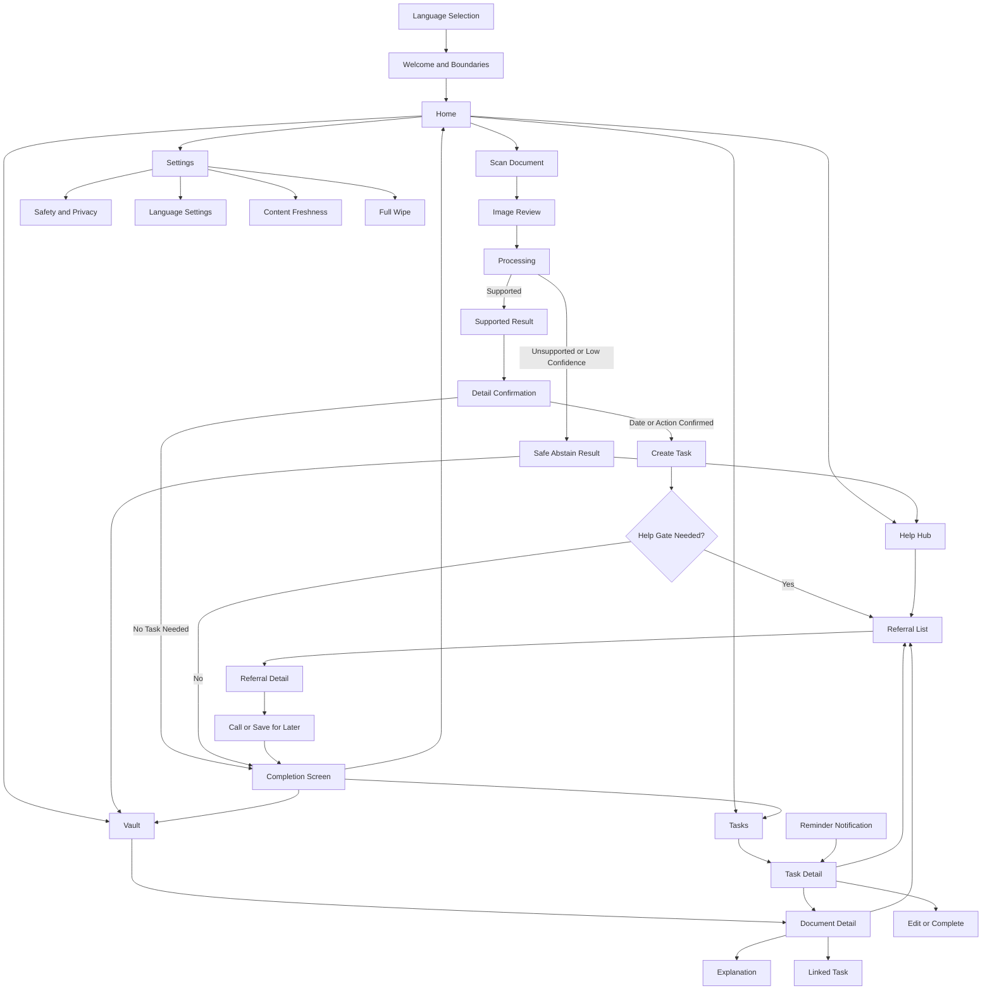

# V1 Wireflow

```mermaid
flowchart TD
    A[Language Selection] --> B[Welcome and Boundaries]
    B --> C[Home]

    C --> E[Scan Document]
    C --> V[Vault]
    C --> T[Tasks]
    C --> H[Help Hub]
    C --> S[Settings]

    E --> F[Image Review]
    F --> G[Processing]

    G -->|Supported| I[Supported Result]
    G -->|Unsupported or Low Confidence| J[Safe Abstain Result]

    I --> K[Detail Confirmation]
    J --> H
    J --> V

    K -->|Date or Action Confirmed| L[Create Task]
    K -->|No Task Needed| M[Completion Screen]

    L --> N{Help Gate Needed?}
    N -->|Yes| O[Referral List]
    N -->|No| M

    O --> P[Referral Detail]
    P --> Q[Call or Save for Later]
    Q --> M

    M --> V
    M --> T
    M --> C

    V --> V1[Document Detail]
    V1 --> V2[Explanation]
    V1 --> V3[Linked Task]
    V1 --> O

    T --> T1[Task Detail]
    T1 --> T2[Edit or Complete]
    T1 --> V1
    T1 --> O

    H --> O

    S --> S1[Safety and Privacy]
    S --> S2[Language Settings]
    S --> S3[Content Freshness]
    S --> S4[Full Wipe]

    R[Reminder Notification] --> T1
```