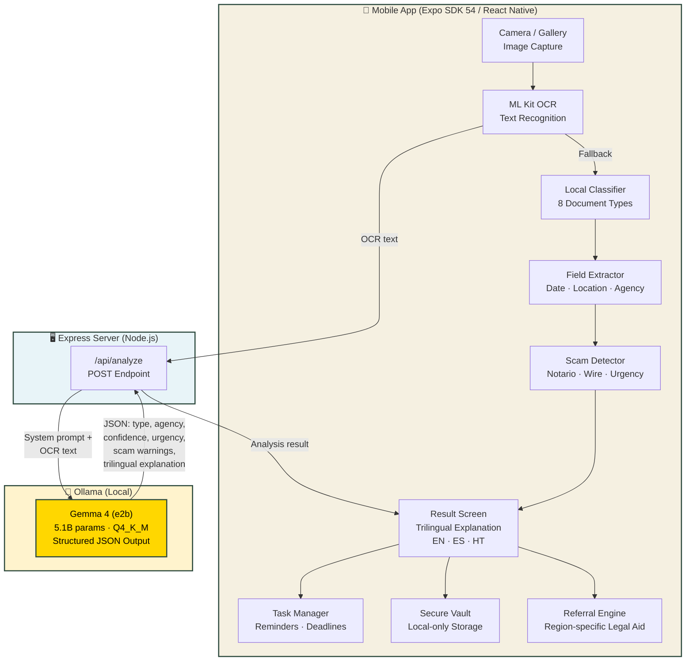

# Claro — Architecture Diagram

## Data Flow Summary

1. **Image Input** → User captures/selects document image
2. **OCR** → ML Kit extracts text from image
3. **Gemma 4 Analysis** → OCR text sent to Ollama via Express API
4. **Structured Response** → Gemma returns document type, confidence, trilingual explanation, scam warnings
5. **Fallback Path** → If Gemma unavailable, local regex classifier + field extractor + scam detector
6. **User Actions** → Confirm fields → Create reminders → Get region-specific legal referrals
7. **Local Storage** → Documents and tasks stored on-device only (privacy-first)
